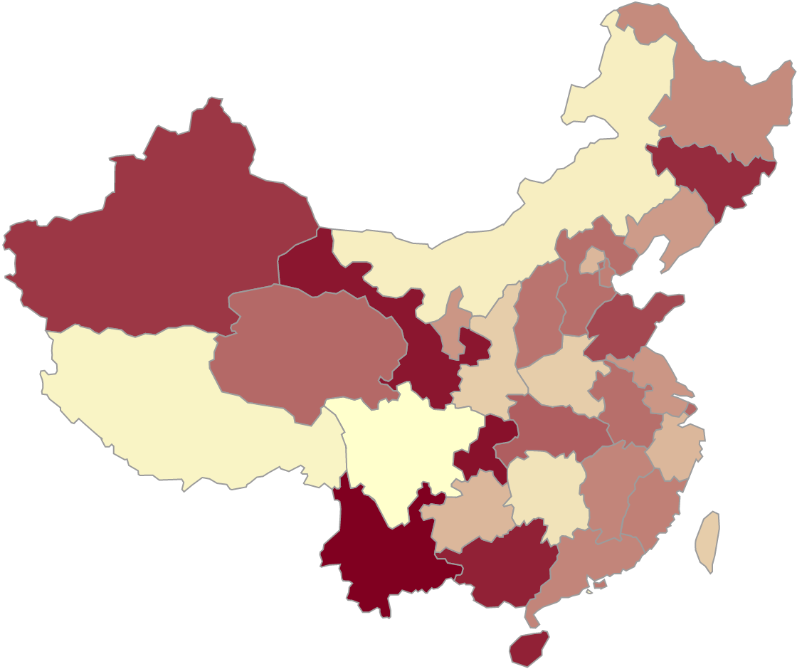

# 数据可视化小工具---中国地图
> 如果你需要在一张中国地图上, 用不同深浅的颜色来表示各省的不同数据, (如 GDP, 森林覆盖率等等数据), 那么, 这个小工具可以帮你快速完成



### 兼容性
必须使用现代浏览器打开(IE无效), 仅在Chrome和Safari上测试过, 建议使用Chrome打开


### 在线版
直接访问 <a>https://zhangqixiangchina.github.io/China-Map/</a>

### 本地版

- 命令行下载(先确保你安装了[Git](https://git-scm.com/book/zh/v2/%E8%B5%B7%E6%AD%A5-%E5%AE%89%E8%A3%85-Git))

	```
	git clone https://github.com/ZhangQixiangChina/China-Map.git
	cd China-Map
	git checkout gh-pages
	```
	接着直接点击`index.html`来打开页面

- 直接下载
	1. 本页面左上方, 切换[Branch:master] 至 [Branch:gh-pages]
	2. 点击右上方[Clone or download], 接着点击[Download ZIP]
	3. 解压下载下来的压缩包, 点击`index.html`打开页面
